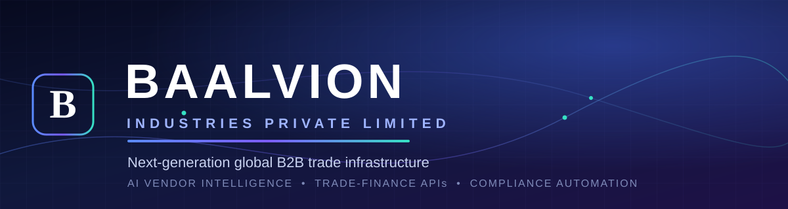
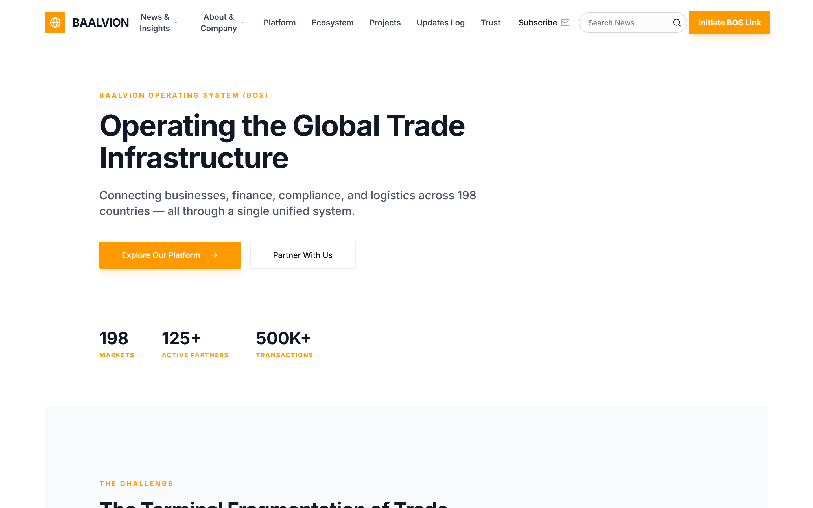
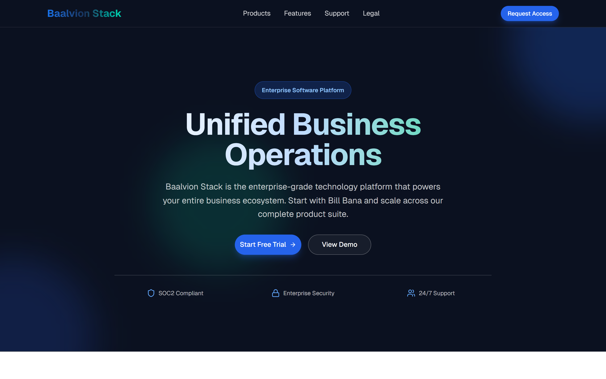
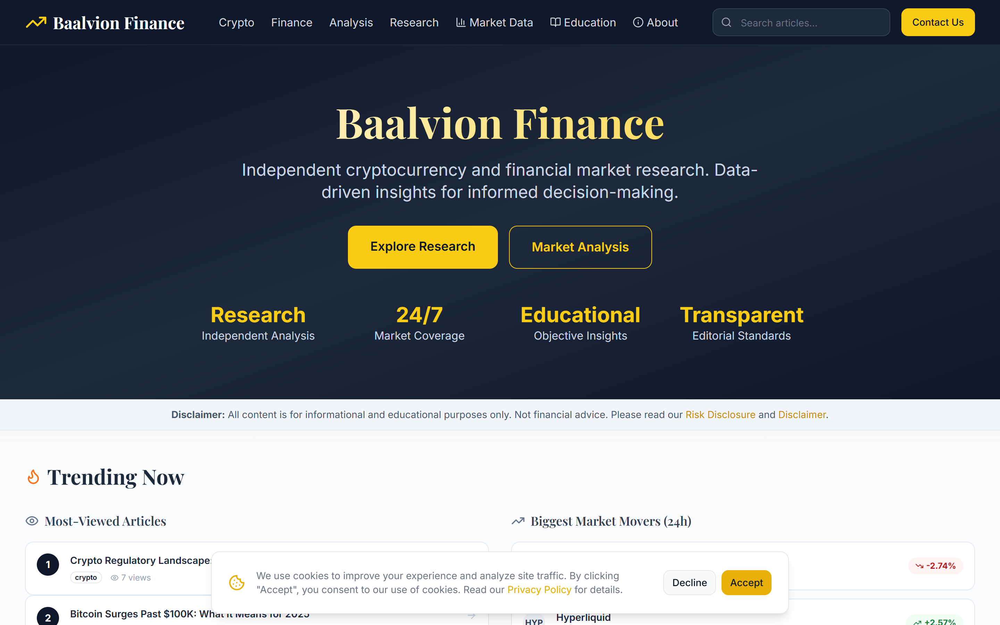
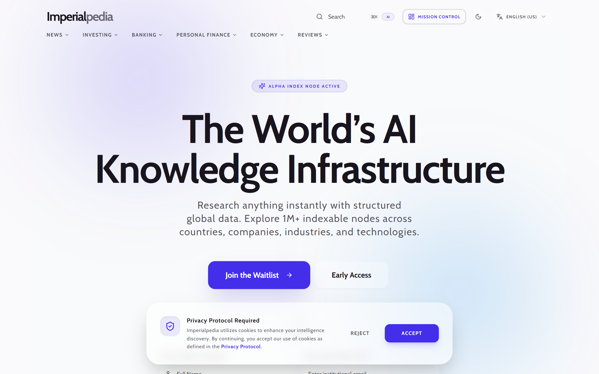
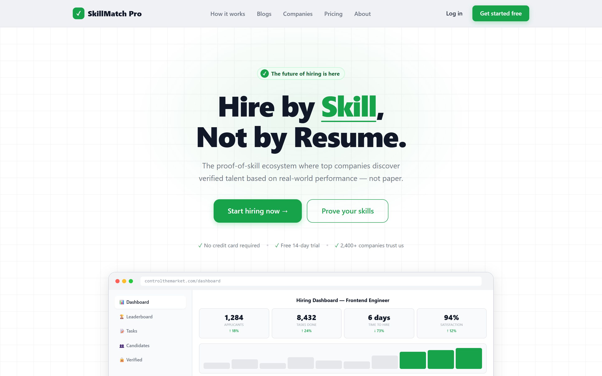
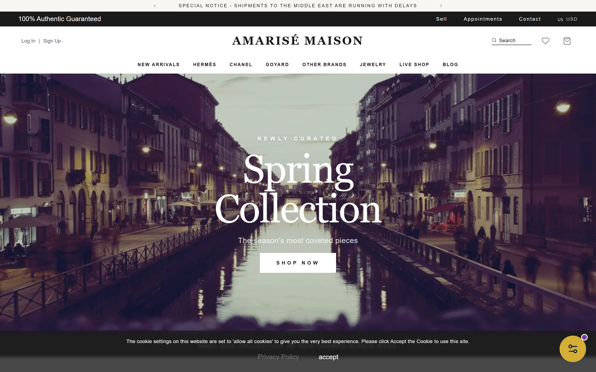

<div align="center">
  
</div>

<div align="center">

<br/>

### Engineering the digital backbone of global commerce

**One platform that connects buyers, suppliers, financiers, and regulators across borders** — turning
fragmented, paperwork-heavy trade into a single programmable, compliant, and intelligent system.

<br/>

[](https://baalvion.com)
[](https://baalvionstack.com)
[](https://www.linkedin.com/company/baalvion)
[](https://twitter.com/baalvion)
[](https://www.youtube.com/@baalvion)
[](https://medium.com/@baalvion)


<sub>
  <a href="#-who-we-are">Who we are</a> &nbsp;·&nbsp;
  <a href="#%EF%B8%8F-product-showcase">Showcase</a> &nbsp;·&nbsp;
  <a href="#-platforms--products">Platforms</a> &nbsp;·&nbsp;
  <a href="#%EF%B8%8F-platform-architecture">Architecture</a> &nbsp;·&nbsp;
  <a href="#-explore-the-source">Repositories</a> &nbsp;·&nbsp;
  <a href="#-by-the-numbers">By the numbers</a> &nbsp;·&nbsp;
  <a href="#-work-with-us">Work with us</a>
</sub>

</div>

---

## 🌐 Who we are

**Baalvion Industries Private Limited** is a technology group engineering the digital backbone of
global commerce. We design, build, and operate an integrated platform that connects **buyers,
suppliers, financiers, and regulators** across borders — turning fragmented, paperwork-heavy trade
into a single programmable, compliant, and intelligent system.

From **trade execution and finance** to **vendor intelligence, compliance automation, and
infrastructure-as-a-service**, every product we ship shares one mission: *make global B2B trade fast,
trustworthy, and accessible to everyone.*

<div align="center">

> ### One identity. One platform. Every market.

</div>

---

## 🧭 What we build

<table>
  <tr>
    <td width="33%" valign="top">
      <h4>🌍 Trade, made programmable</h4>
      <sub>Execution, RFQ &amp; quotes, logistics, customs, and trade finance — wired into a single
      operating system instead of a hundred disconnected portals and PDFs.</sub>
    </td>
    <td width="33%" valign="top">
      <h4>🧠 Intelligence at every step</h4>
      <sub>AI vendor intelligence, risk and compliance automation, and document understanding that
      turn raw trade data into decisions traders and regulators can trust.</sub>
    </td>
    <td width="33%" valign="top">
      <h4>🏛️ Infrastructure for everyone</h4>
      <sub>Identity, payments, knowledge, and operations delivered as governed platform services —
      so a new market or product is a configuration, not a rebuild.</sub>
    </td>
  </tr>
</table>

---

## 🖼️ Product showcase

<table>
  <tr>
    <td width="33%" align="center" valign="top">
      <a href="https://baalvion.com"></a>
      <br/><b>Baalvion</b><br/><sub>The global trade operating system</sub>
    </td>
    <td width="33%" align="center" valign="top">
      <a href="https://baalvionstack.com"></a>
      <br/><b>Baalvion Stack</b><br/><sub>Unified business operations</sub>
    </td>
    <td width="33%" align="center" valign="top">
      <a href="https://market.baalvion.com"></a>
      <br/><b>Baalvion Finance</b><br/><sub>Market research &amp; analytics</sub>
    </td>
  </tr>
  <tr>
    <td width="33%" align="center" valign="top">
      <a href="https://imperialpedia.com"></a>
      <br/><b>Imperialpedia</b><br/><sub>AI knowledge infrastructure</sub>
    </td>
    <td width="33%" align="center" valign="top">
      <a href="https://controlthemarket.com"></a>
      <br/><b>ControlTheMarket</b><br/><sub>Skill-based hiring marketplace</sub>
    </td>
    <td width="33%" align="center" valign="top">
      <a href="https://amarisemaisonavenue.com"></a>
      <br/><b>Amarisé Maison</b><br/><sub>Luxury house</sub>
    </td>
  </tr>
</table>

---

## 🚀 Platforms &amp; products

### Flagship platforms

| Platform | What it does | Live |
| :--- | :--- | :--- |
| 🌍 **Baalvion OS (BOS)** | Global trade infrastructure — execution, finance, compliance &amp; logistics across 198 markets | [about.baalvion.com](https://about.baalvion.com) |
| 🛰️ **Baalvion Stack** | Enterprise unified business-operations platform | [baalvionstack.com](https://baalvionstack.com) |
| 🔐 **Baalvion NetStack** | Enterprise proxy &amp; data network — secure access at scale | [proxy.baalvionstack.com](https://proxy.baalvionstack.com) |
| 📈 **Baalvion Finance** | Crypto &amp; financial-market research and analytics | [market.baalvion.com](https://market.baalvion.com) |

### Marketplaces &amp; verticals

| Product | What it does | Live |
| :--- | :--- | :--- |
| 📚 **Imperialpedia** | AI-powered knowledge &amp; financial-research infrastructure | [imperialpedia.com](https://imperialpedia.com) |
| 🎯 **ControlTheMarket** | Skill-based hiring marketplace (SkillMatch Pro) | [controlthemarket.com](https://controlthemarket.com) |
| 🔒 **Baalvion Insiders** | Private network for verified investors &amp; founders | [marketunderworld.com](https://marketunderworld.com) |
| 💼 **TalentOS** | Global talent acquisition &amp; careers | [jobs.baalvion.com](https://jobs.baalvion.com) |
| 🧾 **BillBana** | GST-ready billing, inventory &amp; accounting for Indian businesses | [shop.baalvionstack.com](https://shop.baalvionstack.com) |
| 💎 **Amarisé Maison** | Luxury house — digital storefront &amp; brand experience | [amarisemaisonavenue.com](https://amarisemaisonavenue.com) |
| ⛏️ **Baalvion Mining** | B2B mineral-trading marketplace | [mining.baalvion.com](https://mining.baalvion.com) |

### Corporate &amp; operations surfaces

| Surface | Purpose | Live |
| :--- | :--- | :--- |
| 🤝 **Baalvion Connect** | Brand &amp; creator collaboration marketplace | [connect.baalvion.com](https://connect.baalvion.com) |
| 🧭 **Unified Dashboard** | Cross-business operations, HR &amp; analytics console | [dashboard.baalvion.com](https://dashboard.baalvion.com) |
| 📊 **Investor Relations** | Press releases, news &amp; investor communications | [ir.baalvion.com](https://ir.baalvion.com) |
| 🏢 **Corporate** | Group home | [baalvion.com](https://baalvion.com) |

---

## 🏗️ Platform architecture

Our entire ecosystem runs on a single, governed **platform foundation** — a federated monorepo
organized around bounded contexts, with shared infrastructure and one centralized identity plane.

```
                         ┌──────────────────────────────┐
                         │   Centralized Identity (SSO)  │
                         │   RS256 · OAuth2 · RBAC/ABAC  │
                         └───────────────┬──────────────┘
                                         │
            ┌────────────────────────────┼────────────────────────────┐
            │                 API Gateway / BFF Federation             │
            └───┬───────────┬───────────┬───────────┬───────────┬──────┘
                │           │           │           │           │
            ┌───┴───┐  ┌────┴───┐  ┌────┴───┐  ┌────┴────┐  ┌───┴────┐
            │Identity│  │Commerce│  │ Trade  │  │Knowledge│  │ Infra  │
            │ domain │  │ domain │  │/Finance│  │ domain  │  │ domain │
            └────────┘  └────────┘  └────────┘  └─────────┘  └────────┘
              60+ domain microservices · event-driven (Redis Streams) · multi-tenant (Postgres RLS)
```

| Pillar | How it works |
| :--- | :--- |
| 🔐 **Centralized auth** | One RS256 issuer, no hand-rolled JWT, single sign-on across every property |
| 🌉 **Federated gateway** | A single governed edge fronting independent domain services and BFFs |
| 🏢 **Multi-tenancy** | Postgres Row-Level Security with fail-closed tenant isolation |
| 🛡️ **Hybrid RBAC + ABAC** | Platform → country → organization authorization hierarchy |
| 📡 **Event-driven** | Durable Redis Streams event bus with tamper-evident audit trails |
| 🧩 **Polyglot by design** | TypeScript/Node for platform &amp; product, Java/Spring Boot for financial-grade services |

---

## 📦 Explore the source

We publish much of the platform in the open. These are the public repositories behind the products above.

| Repository | Powers | |
| :--- | :--- | :--- |
| [**Baalvion-Project-Infra**](https://github.com/baalvionservice/Baalvion-Project-Infra) | Enterprise platform monorepo — identity, gateway, RBAC, federated services | `monorepo` |
| [**Global-Trade-Infrastructure**](https://github.com/baalvionservice/Global-Trade-Infrastructure) | Baalvion OS — cross-border trade, finance, compliance &amp; logistics (Next.js 15) | `platform` |
| [**trade-service**](https://github.com/baalvionservice/trade-service) | Trade execution, RFQ/quotes, logistics &amp; trade-finance API | `service` |
| [**Proxy-BaalvionStack**](https://github.com/baalvionservice/Proxy-BaalvionStack) | NetStack — enterprise proxy &amp; data-network platform | `platform` |
| [**company-unified-Dashboard**](https://github.com/baalvionservice/company-unified-Dashboard) | Cross-business operations, HR &amp; analytics console | `app` |
| [**Imperialpedia**](https://github.com/baalvionservice/Imperialpedia) | AI knowledge &amp; reference encyclopedia | `app` |
| [**controlthemarket**](https://github.com/baalvionservice/controlthemarket) | Skill-based hiring marketplace | `app` |
| [**AmariseMaisonAvenue**](https://github.com/baalvionservice/AmariseMaisonAvenue) | Amarisé Maison — luxury digital storefront | `app` |
| [**Baalvion-Jobs-Portal**](https://github.com/baalvionservice/Baalvion-Jobs-Portal) | TalentOS — careers &amp; applicant experience | `app` |
| [**brand-connector**](https://github.com/baalvionservice/brand-connector) | Baalvion Connect — brand &amp; partner engagement | `app` |
| [**about-baalvion**](https://github.com/baalvionservice/about-baalvion) | Corporate site — vision, businesses &amp; leadership | `app` |
| [**IR-Baalvion**](https://github.com/baalvionservice/IR-Baalvion) | Investor relations — press, news &amp; communications | `app` |
| [**portfolio**](https://github.com/baalvionservice/portfolio) | Corporate product portfolio · [live](https://baalvionservice.github.io/portfolio) | `showcase` |

---

## 🛠️ Technology

<div align="center">


</div>

---

## 📊 By the numbers

<div align="center">

| | | |
| :---: | :---: | :---: |
| **6** | **60+** | **15+** |
| bounded-context domains | domain microservices | live digital products |
| **198** | **Multi-tenant** | **Centralized** |
| markets in scope | Postgres RLS isolation | RS256 single sign-on |
| **Polyglot** | **Event-driven** | **Open** |
| Node &amp; Java/Spring | durable Redis Streams bus | source published for transparency |

</div>

---

## 🤝 Work with us

- 🧑‍💼 **Careers** — we're hiring across engineering, trade, and operations → [jobs.baalvion.com](https://jobs.baalvion.com)
- 📈 **Investors** — financial news &amp; communications → [ir.baalvion.com](https://ir.baalvion.com)
- 🤝 **Partnerships** — integrate or co-build with us → [connect.baalvion.com](https://connect.baalvion.com)
- ✉️ **Contact** — [infra.baalvion@gmail.com](mailto:infra.baalvion@gmail.com)

---

<div align="center">

<sub>© 2025–2026 <b>Baalvion Industries Private Limited</b> &middot; CIN U43121OD2025PTC048479 &middot; India</sub><br/>
<sub>Source published for transparency. All rights reserved unless a repository states otherwise.</sub>

<br/><br/>

<sub><b>One identity · One platform · Every market.</b></sub>

</div>
